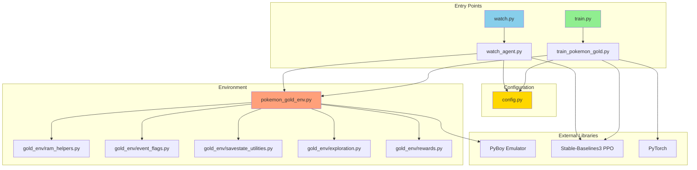
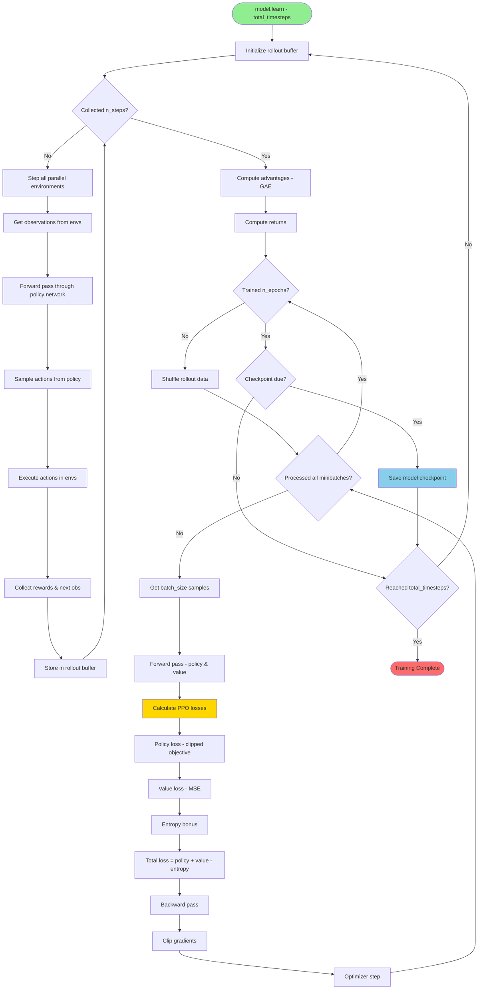
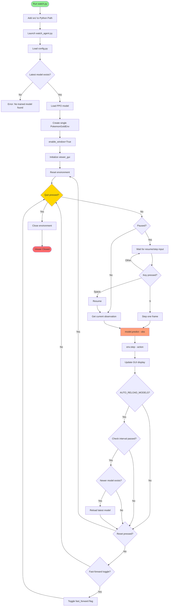
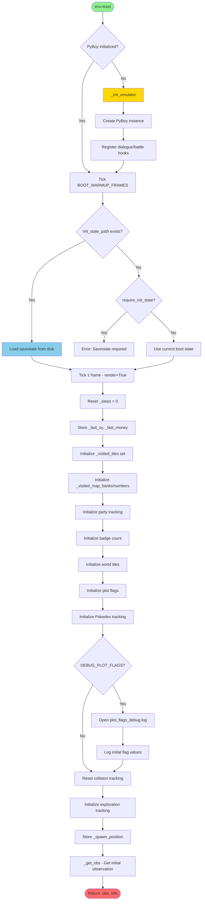

# Pokemon Gold RL - Program & Training Execution Flowchart

This document provides comprehensive flowcharts showing how the Pokemon Gold reinforcement learning system executes, from program startup through training and environment interaction.

## Table of Contents
1. [Overall Architecture](#1-overall-architecture)
2. [Training Execution Flow](#2-training-execution-flow)
3. [Environment Step Cycle](#3-environment-step-cycle)
4. [Reward Calculation Flow](#4-reward-calculation-flow)
5. [PPO Training Loop](#5-ppo-training-loop)
6. [Watch/Viewer Flow](#6-watchviewer-flow)

---

## 1. Overall Architecture

---

## 2. Training Execution Flow

```mermaid
flowchart TD
    Start([Run train.py]) --> AddPath[Add src/ to Python Path]
    AddPath --> LaunchTrain[Launch train_pokemon_gold.py]

    LaunchTrain --> LoadConfig[Load config.py]
    LoadConfig --> SetThreads{TORCH_NUM_THREADS set?}
    SetThreads -->|Yes| SetEnvVars[Set OMP/MKL/OPENBLAS thread limits]
    SetThreads -->|No| SkipThreads[Use default threading]
    SetEnvVars --> ImportLibs[Import NumPy, PyTorch, SB3]
    SkipThreads --> ImportLibs

    ImportLibs --> ConfigureGPU{CUDA Available?}
    ConfigureGPU -->|Yes| EnableCUDA[Enable cuDNN benchmark, TF32]
    ConfigureGPU -->|No| UseCPU[Use CPU device]
    EnableCUDA --> CreateEnvs
    UseCPU --> CreateEnvs

    CreateEnvs[Create Parallel Environments] --> ParallelType{NUM_ENVS > 1 && USE_SUBPROC?}
    ParallelType -->|Yes| SubProc[SubprocVecEnv - True Parallel]
    ParallelType -->|No| Dummy[DummyVecEnv - Sequential]

    SubProc --> WrapEnvs[Add VecMonitor]
    Dummy --> WrapEnvs
    WrapEnvs --> NormalizeEnv[Add VecNormalize - norm_reward=True]
    NormalizeEnv --> StackFrames{FRAME_STACK > 0?}
    StackFrames -->|Yes| AddStack[Add VecFrameStack]
    StackFrames -->|No| CheckCheckpoint
    AddStack --> CheckCheckpoint

    CheckCheckpoint{Checkpoint Exists?} -->|Yes| LoadModel[Load PPO Model from Checkpoint]
    CheckCheckpoint -->|No| CreateModel[Create New PPO Model]

    LoadModel --> SetupCallback
    CreateModel --> SetupCallback[Setup CheckpointCallback]

    SetupCallback --> TrainingMode{Training Mode?}
    TrainingMode -->|Time-Boxed| TimeBox[Set end_time from OVERNIGHT_TRAIN_SECONDS]
    TrainingMode -->|Step-Based| StepBased[Use TOTAL_TRAINING_STEPS]

    TimeBox --> TimeBoxLoop{time.time < end_time?}
    TimeBoxLoop -->|Yes| TrainChunk[model.learn - TRAIN_CHUNK_STEPS]
    TimeBoxLoop -->|No| SaveFinal
    TrainChunk --> CheckTime{> 1 min remaining?}
    CheckTime -->|Yes| TimeBoxLoop
    CheckTime -->|No| SaveFinal

    StepBased --> TrainFull[model.learn - TOTAL_TRAINING_STEPS]
    TrainFull --> SaveFinal

    SaveFinal[Save Final Model] --> Evaluate[Run Evaluation Episodes]
    Evaluate --> End([Training Complete])

    style Start fill:#90EE90
    style End fill:#FF6B6B
    style CreateModel fill:#FFD700
    style LoadModel fill:#87CEEB
    style TrainChunk fill:#FFA07A
    style TrainFull fill:#FFA07A
```

---

## 3. Environment Step Cycle

```mermaid
flowchart TD
    Start([env.step - action]) --> StorePos[Store position before action]

    StorePos --> HandleAction[_handle_action_input - action]
    HandleAction --> ActionType{Action Type?}

    ActionType -->|NOOP| IdleFrames[Tick frame_skip frames]
    ActionType -->|Button| PressButton[Send press event]

    PressButton --> HoldButton[Tick input_hold_frames]
    HoldButton --> ReleaseButton[Send release event]
    ReleaseButton --> WaitRelease[Tick post_release_frames]

    IdleFrames --> GetObs
    WaitRelease --> GetObs[_get_obs - Get screen]

    GetObs --> GetFrame[Get RGBA frame from PyBoy]
    GetFrame --> ConvertGray[Convert to grayscale - RGB//3]
    ConvertGray --> Downsample[Downsample 2x - 72x80]
    Downsample --> CheckPos[Get position after action]

    CheckPos --> DetectCollision{Is movement action && pos unchanged?}
    DetectCollision -->|Yes| IncrementCollision[Increment collision_count]
    DetectCollision -->|No| ResetCollision[Reset collision_count to 0]

    IncrementCollision --> UpdateTracking
    ResetCollision --> UpdateTracking[Update exploration tracking]

    UpdateTracking --> AppendAction[Append action to action_history]
    AppendAction --> AppendPos[Append position to position_history]
    AppendPos --> IncrementStep[Increment step_count]

    IncrementStep --> VerifyPause{VERIFY_PAUSE_STATE?}
    VerifyPause -->|Yes| CheckTextbox[Check wTextboxFlags RAM]
    VerifyPause -->|No| CalcReward
    CheckTextbox --> TextboxActive{Textbox active && not paused?}
    TextboxActive -->|Yes| ForcePause[Force dialog_depth=1]
    TextboxActive -->|No| CalcReward
    ForcePause --> CalcReward

    CalcReward[_calculate_reward] --> UpdateEpisodeStep[Increment _steps]
    UpdateEpisodeStep --> CheckTermination

    CheckTermination{_steps >= max_steps?} -->|Yes| Truncated[truncated=True]
    CheckTermination -->|No| NotTruncated[truncated=False]

    Truncated --> BuildInfo
    NotTruncated --> BuildInfo[Build info dict]

    BuildInfo --> Return([Return: obs, reward, terminated, truncated, info])

    style Start fill:#90EE90
    style Return fill:#FF6B6B
    style CalcReward fill:#FFD700
    style DetectCollision fill:#FFA07A
```

---

## 4. Reward Calculation Flow

```mermaid
flowchart TD
    Start([_calculate_reward]) --> Init[reward = 0.0]

    Init --> GetPos[Get current position]
    GetPos --> CheckPause{_pause_penalties?}

    CheckPause -->|Yes - Dialog/Battle| SkipMovement[Skip movement rewards]
    CheckPause -->|No| CheckStep[Apply STEP_PENALTY]

    CheckStep --> CheckTile{New tile?}
    CheckTile -->|Yes| NewTileReward[+NEW_TILE_REWARD]
    CheckTile -->|No| CheckRepeated{Repeated tile?}
    CheckRepeated -->|Yes| RepeatedPenalty[-REPEATED_TILE_PENALTY]
    CheckRepeated -->|No| CheckCollision

    NewTileReward --> CheckCollision
    RepeatedPenalty --> CheckCollision{Collision detected?}

    CheckCollision -->|Yes| CalcCollisionPenalty[Calculate collision penalty<br/>with exponential escalation]
    CheckCollision -->|No| NoveltyBonus
    CalcCollisionPenalty --> ClipCollision[Clip to COLLISION_PENALTY_MIN]
    ClipCollision --> NoveltyBonus

    NoveltyBonus{NOVELTY_BONUS_ENABLED?} -->|Yes| CalcNovelty[_calculate_novelty_bonus]
    NoveltyBonus -->|No| StuckDetection
    CalcNovelty --> StuckDetection

    StuckDetection{STUCK_DETECTION_ENABLED?} -->|Yes| CheckStuck[_detect_stuck]
    StuckDetection -->|No| ActionDiversity
    CheckStuck --> IsStuck{Stuck detected?}
    IsStuck -->|Yes| StuckPenalty[-STUCK_PENALTY]
    IsStuck -->|No| ActionDiversity
    StuckPenalty --> ActionDiversity

    ActionDiversity{ACTION_DIVERSITY_ENABLED?} -->|Yes| CalcDiversity[_calculate_action_diversity]
    ActionDiversity -->|No| DistanceReward
    CalcDiversity --> DistanceReward

    DistanceReward{DISTANCE_REWARD_ENABLED?} -->|Yes| CalcDistance[_calculate_distance_reward]
    DistanceReward -->|No| OneShot
    CalcDistance --> OneShot

    SkipMovement --> OneShot[One-Shot Event Rewards]
    OneShot --> CheckBadges{New badge earned?}

    CheckBadges -->|Yes| BadgeReward[+BADGE_REWARDS array<br/>15-50 per badge]
    CheckBadges -->|No| CheckWorldTile
    BadgeReward --> CheckWorldTile

    CheckWorldTile{New world tile?} -->|Yes| WorldTileReward[+NEW_WORLD_TILE_REWARD]
    CheckWorldTile -->|No| CheckMapBank
    WorldTileReward --> CheckMapBank

    CheckMapBank{New map bank?} -->|Yes| MapBankReward[+NEW_MAP_BANK_REWARD]
    CheckMapBank -->|No| CheckMapNumber
    MapBankReward --> CheckMapNumber

    CheckMapNumber{New map number?} -->|Yes| MapNumberReward[+NEW_MAP_NUMBER_REWARD]
    CheckMapNumber -->|No| CheckPokedex
    MapNumberReward --> CheckPokedex

    CheckPokedex{New species seen?} -->|Yes| SeenReward[+NEW_SPECIES_SEEN_REWARD]
    CheckPokedex -->|No| CheckCaught
    SeenReward --> CheckCaught

    CheckCaught{New species caught?} -->|Yes| CaughtReward[+NEW_SPECIES_CAUGHT_REWARD]
    CheckCaught -->|No| CheckParty
    CaughtReward --> CheckParty

    CheckParty{Party count increased?} -->|Yes| PartyReward[+NEW_POKEMON_CAUGHT_REWARD]
    CheckParty -->|No| CheckLevels
    PartyReward --> CheckLevels

    CheckLevels{Total levels increased?} -->|Yes| LevelReward[+POKEMON_LEVEL_UP_REWARD]
    CheckLevels -->|No| CheckStats
    LevelReward --> CheckStats

    CheckStats{Stats increased?} -->|Yes| StatReward[+HP/Atk/Def * MULTIPLIER]
    CheckStats -->|No| CheckPlotFlags
    StatReward --> CheckPlotFlags

    CheckPlotFlags{Plot flags enabled?} -->|Yes| IterateFlags[Check each PLOT_FLAG_REWARDS]
    CheckPlotFlags -->|No| ClipReward
    IterateFlags --> FlagSet{Flag newly set?}
    FlagSet -->|Yes| PlotReward[+PLOT_FLAG_REWARDS value]
    FlagSet -->|No| ClipReward
    PlotReward --> ClipReward

    ClipReward[Clip reward to ±REWARD_CLIP_ABS] --> Return([Return reward])

    style Start fill:#90EE90
    style Return fill:#FF6B6B
    style BadgeReward fill:#FFD700
    style CheckPause fill:#FFA07A
    style OneShot fill:#87CEEB
```

---

## 5. PPO Training Loop

---

## 6. Watch/Viewer Flow

---

## Environment Reset Flow (Detailed)

---

## Key Observations

### Training Performance Optimizations
1. **Threading Control**: Limits CPU threads via `TORCH_NUM_THREADS` to prevent oversubscription
2. **GPU Optimizations**: Enables cuDNN benchmark and TF32 for faster training on modern GPUs
3. **Parallel Environments**: Uses `SubprocVecEnv` for true parallelism across CPU cores
4. **Frame Stacking**: Optional VecFrameStack for temporal information without RNNs
5. **Reward Normalization**: VecNormalize with `norm_reward=True` to stabilize training

### Environment Design
1. **Observation Processing**: Downsamples 160x144 → 80x72 grayscale for efficiency
2. **Action Timing**: Holds buttons for `INPUT_HOLD_FRAMES` to ensure game registers input
3. **Collision Detection**: Tracks consecutive collisions with exponential penalty escalation
4. **Pause System**: Disables movement penalties during dialogues/battles via hooks
5. **Anti-Stuck Mechanisms**: Multiple systems to prevent local optima (novelty, diversity, distance)

### Reward System Hierarchy
1. **Badges**: 15-50 points (highest priority)
2. **Pokedex Progress**: 2-10 points per species
3. **Exploration**: 0.02-5.0 points depending on scope
4. **Pokemon Training**: 0.5 points per level
5. **Movement Penalties**: -0.00001 to -1.0 for collisions/repetition

### Checkpoint System
1. **Automatic Resume**: Finds latest checkpoint on startup
2. **Periodic Saves**: Every `CHECKPOINT_SAVE_FREQUENCY` steps
3. **Time-Boxed Training**: Optional time limit instead of step limit
4. **Chunked Training**: Trains in chunks for frequent checkpoint opportunities

---

## Files Reference

| File | Purpose |
|------|---------|
| [train.py](train.py) | Training launcher script |
| [watch.py](watch.py) | Viewer launcher script |
| [config.py](src/config.py) | All configuration and hyperparameters |
| [train_pokemon_gold.py](src/train_pokemon_gold.py) | Main training loop implementation |
| [pokemon_gold_env.py](src/pokemon_gold_env.py) | Gym environment implementation |
| [watch_agent.py](src/watch_agent.py) | Interactive viewer with GUI |
| [gold_env/rewards.py](src/gold_env/rewards.py) | Reward calculation logic |
| [gold_env/exploration.py](src/gold_env/exploration.py) | Anti-stuck mechanisms |
| [gold_env/ram_helpers.py](src/gold_env/ram_helpers.py) | RAM reading utilities |
| [gold_env/event_flags.py](src/gold_env/event_flags.py) | Event flag parsing |
| [gold_env/savestate_utilities.py](src/gold_env/savestate_utilities.py) | Savestate management |

---

## Additional Resources

- **TensorBoard Monitoring**: `tensorboard --logdir _logs`
- **PPO Algorithm**: [Stable-Baselines3 Documentation](https://stable-baselines3.readthedocs.io/en/master/modules/ppo.html)
- **PyBoy Emulator**: [PyBoy GitHub](https://github.com/Baekalfen/PyBoy)
- **Pokemon Gold RAM Map**: [DataCrystal Wiki](https://datacrystal.tcrf.net/wiki/Pokémon_Gold_and_Silver/RAM_map)
